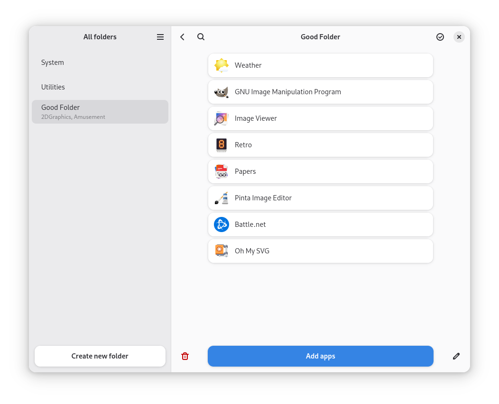

<div align="center">
  
</div>

<div align="center">
  <h1>Folder Manager (aka Foldy)</h1>
</div>

<div align="center"><h3>Application for folders settings.</h4></div>

<div align="center">
  
</div>


### Build from sources
> [!NOTE]
> You need clone recursively.

#### Install dependencies:
> [!NOTE]
> This command works only with ALT Linux, but you can install dependencies manually.
```
sudo apt-get install $(python3 build-tools/get_meson_deps.py)
```

#### Install:
```
meson setup _build
sudo meson install -C _build
```

#### Install local:
> [!TIP]
> You need set `LD_LIBRARY_PATH=~/.local/lib64` so that there are no problems finding the library.
```
meson setup _build --prefix=~/.local
meson install -C _build
```

#### Uninstall:
```
sudo ninja uninstall -C _build
```
